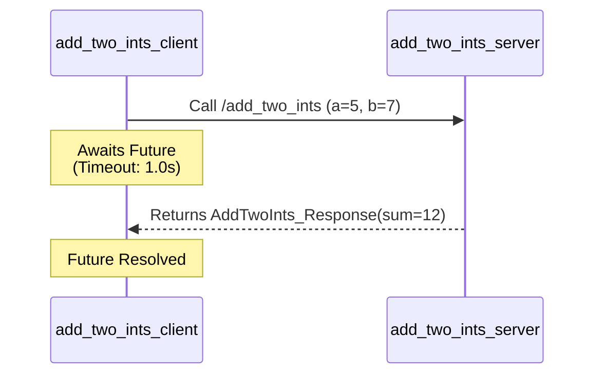

<div align="center">
  
# 🤖 my_first_pkg
  
**Enterprise-Grade Reference Implementation for ROS 2 Node Lifecycles & IPC**

[](#)
[](#)
[](#)
[](#)

</div>

---

## 📖 Overview

`my_first_pkg` is an architectural reference package designed to demonstrate robust Inter-Process Communication (IPC) paradigms within the **ROS 2 (Jazzy)** ecosystem. Built upon the `rclpy` middleware API, it abstracts the underlying Data Distribution Service (DDS) to expose strongly-typed publish/subscribe channels and deterministic request/response service endpoints. 

This repository serves as a foundational scaffold for mid-to-senior robotics engineers evaluating ROS 2 core abstractions, threading models, and package deployment structures via `colcon` and `setuptools`.

---

## ⚡ Core Architecture & Topologies

The package exposes three distinct architectural patterns commonly deployed in asynchronous robotic software stacks:

### 1. Topic-Based Asynchronous Telemetry
Leveraging `std_msgs/String`, the publisher/subscriber topology utilizes a decentralized multicast model.


### 2. Synchronous Remote Procedure Calls (RPC)
For deterministic, one-shot computations, the package implements a synchronous Service-Client topology utilizing the `example_interfaces/srv/AddTwoInts` interface.



---

## 🛠️ Tech Stack & Dependencies

- **Framework**: ROS 2 Jazzy Jalisco
- **Language**: Python ≥ 3.10 (Tested on 3.12)
- **Middleware Integration**: `rclpy`
- **Build System**: `colcon-core` & `setuptools`
- **Standard Interfaces**: `std_msgs`, `example_interfaces`

---

## 🚀 Deployment & Installation

We recommend deploying within a dedicated ROS 2 workspace to avoid system-level package collisions.

### 1. Environment Initialization
Source the base ROS 2 Jazzy overlay.
```bash
source /opt/ros/jazzy/setup.bash
```

### 2. Workspace Compilation
Navigate to your `ros2_ws` root and invoke the `colcon` build system. The `--symlink-install` flag is highly recommended for Python packages to avoid rebuilding upon script modifications.
```bash
colcon build --packages-select my_first_pkg --symlink-install
```

> [!WARNING]  
> If you omit `--symlink-install`, any changes to `*.py` files will require a full recompilation of the package via `colcon build`.

### 3. Source the Local Overlay
```bash
source install/setup.bash
```

---

## 💻 Execution Interfaces

### Asynchronous Pub/Sub Pipeline
Deploy the decoupled communication pipeline across two isolated terminal sessions.

**Terminal 1 (Data Producer):**
```bash
ros2 run my_first_pkg publisher_node
```

**Terminal 2 (Data Consumer):**
```bash
ros2 run my_first_pkg subscriber_node
```

### Synchronous Service Invocation
Spin up the service server to expose the RPC endpoint.

**Terminal 1 (Service Provider):**
```bash
ros2 run my_first_pkg add_two_ints_server
```

**Terminal 2 (Client Application):**
```bash
ros2 run my_first_pkg add_two_ints_client
```

> [!TIP]  
> You can introspect and interact with the service directly via the ROS 2 CLI daemon without running the custom Python client:
> ```bash
> ros2 service call /add_two_ints example_interfaces/srv/AddTwoInts "{a: 5, b: 7}"
> ```

---

## ⚙️ Advanced Configuration (DDS & Middleware)

Because ROS 2 relies on DDS (Data Distribution Service) for discovery and transport, you can modulate the package's network behavior at runtime via POSIX environment variables.

| Environment Variable | Impact | Example Usage |
| :--- | :--- | :--- |
| <kbd>ROS_DOMAIN_ID</kbd> | Subnets DDS traffic to isolate distinct ROS 2 graphs on a shared physical network. | `export ROS_DOMAIN_ID=42` |
| <kbd>RMW_IMPLEMENTATION</kbd> | Hot-swaps the underlying DDS vendor (e.g., FastDDS, CycloneDDS, Connext). | `export RMW_IMPLEMENTATION=rmw_cyclonedds_cpp` |
| <kbd>ROS_LOCALHOST_ONLY</kbd> | Restricts DDS discovery to loopback, preventing network saturation. | `export ROS_LOCALHOST_ONLY=1` |

---

## 🧪 CI/CD & Testing

Execute the local unit testing and linting pipelines (using `ament_copyright`, `ament_flake8`, and `ament_pep257`).

```bash
colcon test --packages-select my_first_pkg
colcon test-result --all --verbose
```

---

## 🗂️ Project Taxonomy

<details>
<summary><b>Click to Expand Dependency & File Tree</b></summary>
<br>

```text
.
├── package.xml                 # ROS 2 manifest (dependencies & metadata)
├── setup.cfg                   # Python package directives
├── setup.py                    # Entry point declarations (ros2 run)
├── my_first_pkg/
│   ├── __init__.py
│   ├── add_two_ints_client.py  # Asynchronous client future-polling
│   ├── add_two_ints_server.py  # Synchronous callback dispatcher
│   ├── publisher_node.py       # Timer-driven state publishing
│   ├── simple_node.py          # Minimal node lifecycle binding
│   └── subscriber_node.py      # Event-driven callback consumption
└── test/                       # Ament-compliant test scaffolding
```
</details>

---

## 📉 Known Architectural Limitations

1. **Static Topology**: Topic and service URIs (`/hello_topic`, `/add_two_ints`) are hardcoded. They currently lack parameterization via `rcl_interfaces` for dynamic remapping.
2. **Blocking Callbacks**: The service server operates in a SingleThreadedExecutor. High-frequency client bursts may induce blocking. Future iterations will adopt `MultiThreadedExecutor` and `ReentrantCallbackGroup`.

## 🛣️ Engineering Roadmap

- [ ] **Launch Orchestration**: Integrate `launch_ros` to initialize both the publisher and subscriber synchronously from a single XML/Python entry point.
- [ ] **Lifecycle Nodes**: Migrate standard `rclpy.node.Node` to `rclpy.lifecycle.Node` for managed state machine transitions (Unconfigured -> Inactive -> Active).
- [ ] **Action Servers**: Implement long-running, interruptible goal tracking using ROS 2 Actions.

---
<div align="center">
  <b>Built and maintained by relvixx.</b>
</div>
