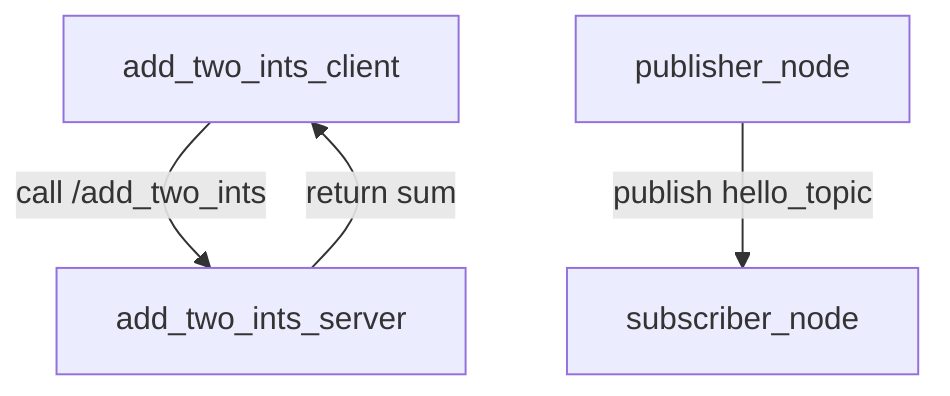

# my_first_pkg

Example ROS 2 Python package for basic `rclpy` patterns: a minimal node, a topic publisher/subscriber pair, and a service/client pair for `example_interfaces/AddTwoInts`.

## Quick Compatibility & Status

- Project type: ROS 2 package
- Stack: ROS 2 Jazzy, Python 3.12, `rclpy`, `colcon`, `setuptools`
- Runtime: console entry points are exposed from `setup.py`
- Status: reference/demo package for learning and code review

## Overview

This package demonstrates the core ROS 2 communication styles in a single Python package. It includes `simple_node` for the minimal node lifecycle, `publisher_node` and `subscriber_node` for topic-based communication, and `add_two_ints_server` plus `add_two_ints_client` for a request/response service pattern. The package is intended as a compact reference implementation for developers who are learning ROS 2 structure and package wiring.



The service path uses a request/response handshake because the add-two-ints operation is a one-shot computation; a topic would force the client to poll on a timer and add unnecessary DDS traffic for a synchronous operation.

## Key Features

- Minimal `rclpy` node example with a logger
- Publisher/subscriber demo over `hello_topic`
- Service/client demo using `AddTwoInts`
- Console scripts for `ros2 run` entry points

## Prerequisites

- ROS 2 Jazzy or a compatible `rclpy` environment
- Python 3.10+ (3.12 used in this workspace)
- `colcon-core` and `setuptools`
- `git` for cloning and version control

## Install

1. Change to your workspace root and source your ROS 2 environment:

   ```bash
   cd /path/to/ros2_jazzy
   source /opt/ros/jazzy/setup.bash
   ```

2. Optionally create a Python virtual environment for local tooling:

   ```bash
   python3 -m venv .venv
   source .venv/bin/activate
   ```

3. Build the package:

   ```bash
   colcon build --packages-select my_first_pkg
   ```

4. Source the generated workspace setup file:

   ```bash
   source install/setup.bash
   ```

ROS 2 workspaces commonly ignore generated artifacts. A practical `.gitignore` snippet is:

```gitignore
build/
install/
log/
*.pyc
__pycache__/
```

## Quick Start — Build & Run

```bash
cd /path/to/ros2_jazzy
source /opt/ros/jazzy/setup.bash
colcon build --packages-select my_first_pkg
source install/setup.bash
```

Run the examples in separate terminals:

```bash
ros2 run my_first_pkg simple_node
ros2 run my_first_pkg publisher_node
ros2 run my_first_pkg subscriber_node
ros2 run my_first_pkg add_two_ints_server
ros2 run my_first_pkg add_two_ints_client
```

## Examples

Start the service server and then call it from another terminal:

```bash
ros2 run my_first_pkg add_two_ints_server
```

```bash
ros2 service call /add_two_ints example_interfaces/srv/AddTwoInts "{a: 5, b: 7}"
```

Expected output includes a response similar to:

```text
response:
example_interfaces.srv.AddTwoInts_Response(sum=12)
```

Run the topic demo with two terminals:

```bash
ros2 run my_first_pkg publisher_node
```

```bash
ros2 run my_first_pkg subscriber_node
```

The subscriber should log the published string from the publisher.

## Tests

Run the package tests with:

```bash
colcon test --packages-select my_first_pkg && colcon test-result --verbose
```

The package includes the standard ament test stubs under `test/`; they are useful for validating packaging and linting in a standard ROS 2 environment.

## File Tree

<details>
<summary>Repository layout</summary>

```text
.
├── build/
├── install/
├── log/
├── src/
│   └── my_first_pkg/
│       ├── package.xml
│       ├── resource/
│       ├── setup.cfg
│       ├── setup.py
│       ├── my_first_pkg/
│       │   ├── __init__.py
│       │   ├── add_two_ints_client.py
│       │   ├── add_two_ints_server.py
│       │   ├── publisher_node.py
│       │   ├── simple_node.py
│       │   └── subscriber_node.py
│       └── test/
```

</details>

## Configuration & Environment

- `ROS_DOMAIN_ID`: set this to isolate DDS traffic when multiple ROS 2 applications share a network.
- `RMW_IMPLEMENTATION`: override the middleware implementation when you need to match a specific DDS vendor or debugging setup.
- `AMENT_PREFIX_PATH`: populated automatically after sourcing `install/setup.bash`.

## Known Limitations

- This package is a reference scaffold rather than a production-ready robotics interface layer.
- The example uses fixed topic and service names, so it does not yet demonstrate parameter-driven configuration or launch-file orchestration.
- The service example is intentionally single-node and synchronous, which is adequate for learning but not ideal for high-throughput or multi-client systems.

## Roadmap

- Add launch files for the publisher/subscriber and service demos
- Introduce parameters and a more realistic node configuration pattern
- Expand the examples to cover actions and lifecycle nodes

## Contributing

Contributions are welcome. Open an issue with the behavior you want to change or the example you want to add, then submit a small pull request with a clear rationale.

## Footer

Maintained by `relvixx`. This package targets ROS 2 distributions that provide `rclpy` and standard interface packages such as `example_interfaces`.
